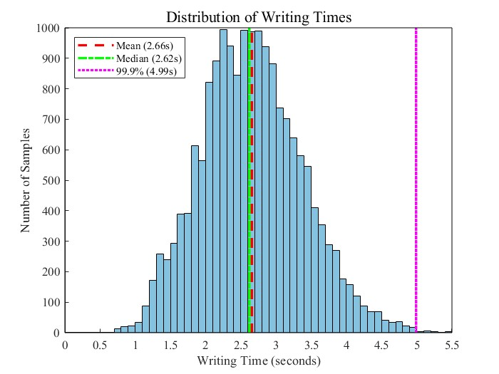
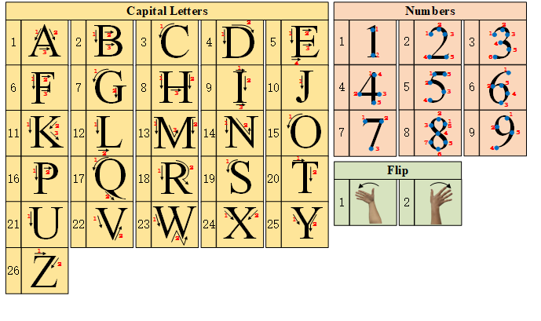

# ZMAD: A multimodal dataset of 3D trajectories, sEMG, and acceleration for air-writing recognition

## Contact Information

For any queries, please email:

fohu@zjut.edu.cn

------

## Data Display and Algorithm

The `Data Display and Algorithm` folder contains the source code for the sample entropy algorithm, as well as MATLAB scripts for visualizing various data displays.

### MATLAB Scripts

1. **DisplayAcc.m**
    Visualizes acceleration data.
2. **DisplayRigiBody1.m**
    Displays the trajectory of 37 handwriting actions from a single participant in the Cartesian coordinate system.
3. **DisplayRigiBody2.m**
    Displays the trajectory of a single handwriting action in the Cartesian coordinate system.
4. **DisplaysEMGin3D.m**
    Visualizes surface electromyography (sEMG) data.
5. **DisplayTrajectory3D.m**
    Displays the trajectory of a single handwriting action in 3D space.

Each script provides detailed visualizations to aid in the analysis and understanding of the corresponding dataset.

------

## Technical Validation Code

The `Technical Validation Code` folder contains scripts for validating the methodology and models.

### Folders

1. **dataloader/**
    Contains preprocessing code for three different modalities used in the dataset. The preprocessing code is modularized to handle different types of data processing tasks, including signal filtering and feature extraction.
2. **networks/**
    Includes seven validation models.
3. **tools/**
    Provides training scripts for three modalities and evaluation metrics for various results.

## Results Overview：

     
    
     
    <strong>Fig1. Statistical Distribution of Writing Durations Across All Samples</strong>
     
     

    
     
    <strong>Fig2. Experimental Scenario</strong>
     
     

 

  
     
     <strong>Fig3. Experimental Workflow Overview</strong>
     
     

  
     
    <strong>Fig4. Sequential Representation of Motion Patterns</strong>
     
     

  
     
    <strong>Fig5. Validation Results</strong>
     
     

# Coming Soon!

The Zhejiang University of Technology Multimodal Air-Writing Dataset (ZMAD) is a multimodal dataset comprising 3D trajectories, sEMG signals, and acceleration data for air-writing recognition. More data will be uploaded after the paper is accepted.